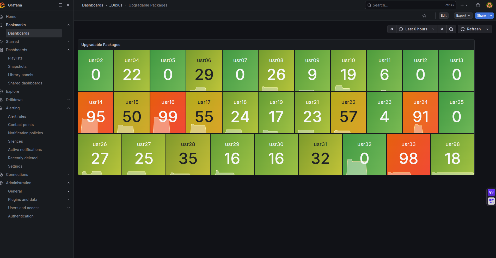

# Automação de Patch Management & Compliance com Ansible 🚀

Este projeto resolve um problema crítico de infraestrutura: automatizar a gestão de atualizações de segurança em 60+ estações de trabalho Ubuntu de forma simultânea e centralizada.

## 📋 Cenário e Motivação
Utilizando monitoramento via **Grafana** (baseado em métricas do **Zabbix**), identifiquei que o parque tecnológico estava com alto risco de segurança devido ao grande volume de pacotes desatualizados, conforme mostrado no dashboard abaixo:


*Hosts críticos como usr16 (99 pacotes) e usr33 (98 pacotes) pendentes de atualização.*

## 🛠️ Stack Tecnológica
- **Ansible / YAML**: Gerenciamento de configuração e Infraestrutura como Código (IaC).
- **SSH (ED25519)**: Comunicação segura e *agentless*.
- **Ubuntu Server/Desktop**: Sistemas de destino.
- **Observability**: Grafana/Zabbix para validação baseada em dados.

## 🚀 Como Executar
O projeto segue as melhores práticas de IaC. Para reproduzir:
1. Configure o inventário em `inventory/hosts.ini`.
2. Certifique-se de que sua chave pública SSH está nos hosts.
3. Execute o Playbook profissional, que trata de erros e reboots:

   ```bash
   ansible-playbook playbooks/update_system.yml
