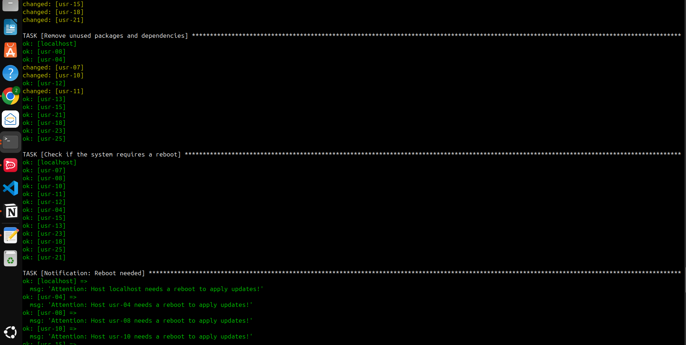
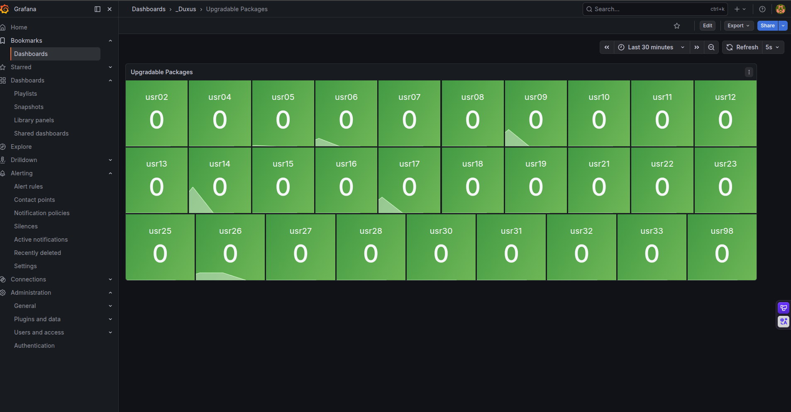

# Automação de Patch Management & Compliance com Ansible 🚀

Projeto de Infraestrutura como Código (IaC) para automatizar atualizações de segurança em **60+ estações Ubuntu**, com execução centralizada, segura e escalável via Ansible.

## 🎯 Objetivo
Reduzir exposição a vulnerabilidades causadas por pacotes desatualizados, padronizando o processo de manutenção em todo o parque.

## 📌 Cenário
Com base em métricas do **Zabbix** visualizadas no **Grafana**, foi identificado um volume elevado de atualizações pendentes em diversos hosts (ex.: `usr16` com 99 pacotes e `usr33` com 98 pacotes).

### Antes da automação


### Execução do playbook


### Resultado após automação


## 🛠️ Stack
- **Ansible + YAML** para orquestração de configuração
- **SSH (ED25519)** para conexão segura agentless
- **Ubuntu Server/Desktop** como alvo
- **Grafana + Zabbix** para observabilidade e validação de compliance

## 📁 Estrutura do projeto
```text
.
├── ansible.cfg
├── playbooks/
│   └── update_system.yml
├── grafana-antes.png
├── grafana-depois.png
└── terminal-ansible.png
```

## ✅ O que o playbook faz
1. Atualiza cache do APT
2. Executa upgrade completo (`dist-upgrade`)
3. Remove pacotes e dependências não utilizados
4. Detecta necessidade de reboot e notifica host afetado

## 🚀 Como executar
### 1) Pré-requisitos
- Ansible instalado na máquina de controle
- Conectividade SSH com os hosts Ubuntu
- Usuário remoto com privilégio sudo

### 2) Criar inventário
Crie o arquivo `inventory/hosts.ini` com seu grupo de hosts:

```ini
[usuarios_empresa]
192.168.1.10
192.168.1.11
```

> O `ansible.cfg` já referencia `./inventory/hosts.ini` e define `become = True`.

### 3) Executar o playbook
```bash
ansible-playbook playbooks/update_system.yml
```

Se precisar informar senha de sudo:
```bash
ansible-playbook playbooks/update_system.yml -K
```

## 🔐 Boas práticas aplicadas
- Gestão centralizada e repetível via IaC
- Execução simultânea em múltiplos hosts
- Processo auditável e fácil de versionar
- Validação por evidência visual (antes/depois)

## 📈 Resultado esperado
Queda significativa no número de pacotes pendentes e melhora direta no nível de compliance e postura de segurança do ambiente.
